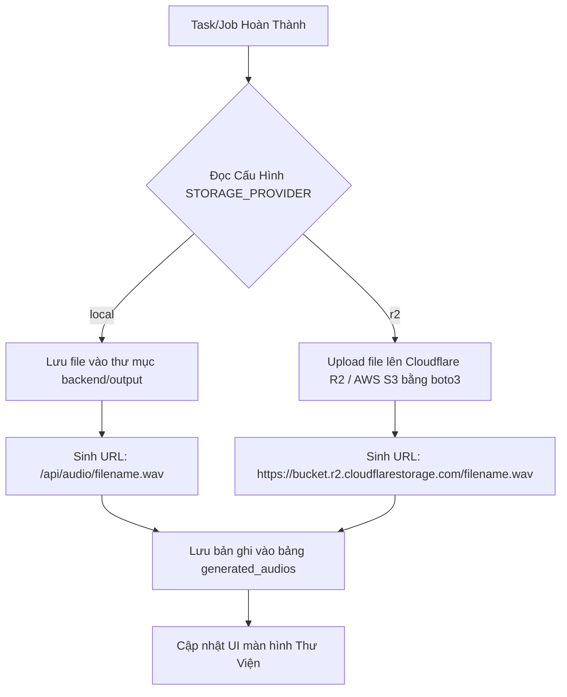

# Specifications: Storage & Audio Library Upgrade

Tài liệu thiết kế kỹ thuật chi tiết cho tính năng nâng cấp hệ thống lưu trữ (Storage Service) và giao diện thư viện quản lý file âm thanh (Audio Library).

---

## 1. Executive Summary (Tóm tắt dự án)
Dự án cần nâng cấp cơ chế lưu trữ để chạy trên VPS Linux lâu dài. Cụ thể:
- Tách biệt logic quản lý file ra một Service riêng (`StorageService`) hỗ trợ hai nhà cung cấp (Providers): **Local VPS** và **AWS R2/S3**.
- Cung cấp khả năng cấu hình lưu trữ song song hoặc chuyển đổi linh hoạt qua biến môi trường.
- Cho phép người dùng nghe thử trực tuyến (Audio Streaming) thông qua trình phát trên giao diện Web mà không cần tải file về.
- Tạo màn hình **Thư Viện Audio** chuyên biệt quản lý danh sách file đã tạo, sao chép link truy cập nhanh và thực hiện dọn dẹp file rác.

---

## 2. User Stories (Kịch bản người dùng)
- **Kịch bản 1 (Tải & nghe trực tuyến):** Người dùng sau khi chạy xong một Batch Job (hoặc Docx Job), mở tab "Thư Viện" -> danh sách các file audio hoàn thành sẽ hiển thị -> bấm nút Play để nghe trực tuyến ngay lập tức, tua thời gian mượt mà.
- **Kịch bản 2 (Chia sẻ link):** Người dùng muốn gửi file audio cho đồng nghiệp -> bấm nút "Copy Link" trên giao diện -> hệ thống sao chép đường link trực tiếp (HTTP stream URL) vào bộ nhớ tạm để gửi qua Zalo/Telegram.
- **Kịch bản 3 (Dọn dẹp):** Bộ nhớ VPS sắp đầy -> người dùng vào Thư Viện -> bấm "Xóa" một file không dùng nữa -> hệ thống tự động xóa bản ghi trong database và xóa file vật lý tương ứng trên đĩa VPS hoặc Cloud R2.

---

## 3. Database Design (Thiết kế Cơ sở dữ liệu)

Bổ sung bảng `generated_audios` để quản lý độc lập các sản phẩm audio đầu ra:

```sql
CREATE TABLE generated_audios (
    id INTEGER PRIMARY KEY AUTOINCREMENT,
    file_name VARCHAR(255) NOT NULL,
    file_path VARCHAR(500) NOT NULL,             -- Đường dẫn vật lý trên đĩa cứng
    storage_provider VARCHAR(50) DEFAULT 'local', -- local hoặc r2
    audio_url VARCHAR(1000) NOT NULL,            -- URL dùng để stream/download
    created_at TIMESTAMP DEFAULT CURRENT_TIMESTAMP
);
```

---

## 4. Logic Flowchart (Sơ đồ luồng xử lý)

Luồng lưu trữ và sinh URL hoạt động như sau:



---

## 5. API Contract (Định nghĩa API)

### 5.1. Stream Audio (Local Provider)
- **Endpoint:** `GET /api/audio/{file_name}`
- **Response:** File Binary (`audio/wav` hoặc `audio/mpeg`).
- **Lưu ý:** Cần hỗ trợ header `Range` để trình duyệt thực hiện Range Requests (phục vụ tính năng tua thời gian trên player).

### 5.2. Lấy danh sách thư viện
- **Endpoint:** `GET /api/library`
- **Method:** `GET`
- **Response JSON:**
  ```json
  {
    "audios": [
      {
        "id": 1,
        "file_name": "file_sample.wav",
        "storage_provider": "local",
        "audio_url": "http://domain.com/api/audio/file_sample.wav",
        "created_at": "2026-06-24T07:30:00Z"
      }
    ]
  }
  ```

### 5.3. Xóa file khỏi thư viện
- **Endpoint:** `DELETE /api/library/{id}`
- **Method:** `DELETE`
- **Response JSON:** `{"status": "ok", "message": "Deleted successfully"}`

---

## 6. UI Components (Giao diện người dùng)

### Màn hình Thư viện âm thanh (AudioLibrary.jsx) gồm 3 phần chính:
1.  **Thanh tìm kiếm & Bộ lọc:** Tìm kiếm file theo tên viết thường/không dấu, lọc theo ngày tạo.
2.  **Bảng danh sách file:**
    - Tên file & Dung lượng.
    - Cột Hành động: Nút **Nghe Thử (Play)**, Nút **Copy Link**, Nút **Tải Về**, Nút **Xóa** (hiển thị Swal confirm).
3.  **Trình phát Audio Mini (Sticky Audio Player):** Nằm cố định ở góc dưới màn hình khi có file đang phát, tích hợp thanh trượt tiến trình (Progress Bar), thời gian chạy, chỉnh âm lượng và nút download nhanh.

---

## 7. Third-party Integrations (Tích hợp bên thứ ba)
Sử dụng thư viện **boto3** kết nối đến Cloudflare R2 (hoặc AWS S3) bằng cấu hình S3 Compatibility API:
```python
import boto3
from botocore.client import Config

s3_client = boto3.client(
    's3',
    endpoint_url=R2_ENDPOINT_URL,
    aws_access_key_id=R2_ACCESS_KEY_ID,
    aws_secret_access_key=R2_SECRET_ACCESS_KEY,
    config=Config(signature_version='s3v4')
)
```

---

## 8. Hidden Requirements (Yêu cầu ngầm cần lưu ý)
- **Range Requests:** FastAPI mặc định trả về toàn bộ file bằng `FileResponse`. Để phát nhạc mượt mà trên Safari/Chrome, ta cần viết custom stream generator hỗ trợ header `Range` (mã HTTP 206 Partial Content).
- **Xóa file vật lý:** Khi xóa một record trong cơ sở dữ liệu, backend bắt buộc phải xóa file thực tế trên đĩa hoặc gọi API xóa trên Cloud R2 để tránh rác dung lượng.

---

## 9. Build Checklist
- [ ] Cài đặt `boto3` trong backend.
- [ ] Viết lớp abstraction `StorageService` và các implementation.
- [ ] Xây dựng API `/api/audio/{file_name}` hỗ trợ Range Requests.
- [ ] Xây dựng API `/api/library` (GET/DELETE).
- [ ] Kết nối queue_manager với StorageService để lưu file đầu ra.
- [ ] Cập nhật App.jsx trên Frontend với giao diện Thư viện & Audio Player.
- [ ] Test tích hợp, tối ưu CSS responsive.
