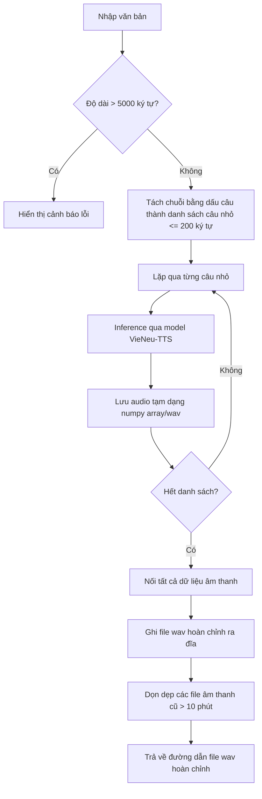

# Spec: VieNeu-TTS Hugging Face Space & REST API

## 1. Executive Summary
Tài liệu này đặc tả chi tiết cấu trúc, tính năng và cách thức triển khai của ứng dụng Text-to-Speech tiếng Việt sử dụng thư viện local VieNeu-TTS chạy trên môi trường Hugging Face Spaces (CPU Basic) thông qua giao diện Gradio SDK và mở rộng API RESTful.

## 2. User Stories
- **Là người dùng cuối:** Tôi muốn nhập văn bản tiếng Việt dài tối đa 5000 ký tự trên web, bấm nút sinh âm thanh và nghe trực tiếp hoặc tải file WAV về máy với tốc độ nhanh nhất.
- **Là lập trình viên:** Tôi muốn gọi API dự báo từ xa bằng JavaScript thông qua thư viện `@gradio/client` hoặc qua REST API chuẩn để tích hợp giọng đọc vào website của tôi mà không cần cài đặt thư viện python local.

## 3. Tech Stack
- **SDK:** Gradio (chạy dưới dạng app python)
- **Framework REST API:** FastAPI
- **Thư viện sinh giọng nói:** `vieneu` (VieNeu-TTS)
- **Thư viện tính toán:** `torch` (CPU mode), `numpy`, `soundfile`
- **Gói hệ thống:** `espeak-ng` (khai báo trong `packages.txt`)

## 4. Logic Flowchart (Text Chunking & Inference)


## 5. API Contract
### POST /api/tts
Gửi yêu cầu chuyển đổi văn bản.

**Request Body:**
```json
{
  "text": "Xin chào thế giới"
}
```

**Response (Success - HTTP 200):**
```json
{
  "success": true,
  "audio_url": "/files/generated_xxxxxx.wav"
}
```

**Response (Error - HTTP 400/500):**
```json
{
  "success": false,
  "error": "Chi tiết lỗi xảy ra"
}
```

## 6. Build Checklist
- [ ] Khởi tạo `requirements.txt`
- [ ] Khởi tạo `packages.txt`
- [ ] Viết hàm tách văn bản và ghép nối âm thanh
- [ ] Xây dựng giao diện Gradio
- [ ] Tích hợp FastAPI REST API endpoint
- [ ] Tối ưu hóa file tạm và xử lý lỗi ngoại lệ
- [ ] Tạo file `README.md` với metadata của Hugging Face
